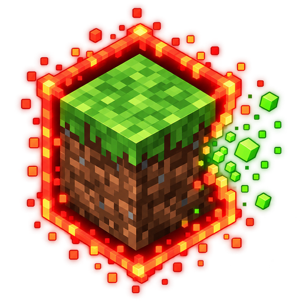

<p align="center"></p>

<h1 align="center">GridLock</h1>

Multiplayer-Challenge für **Paper 26.3**: Alle starten gemeinsam auf einem **1x1-Feld**, umgeben von einer roten Border.
Wer schleichend gegen die Border drückt, kauft für Level den nächsten Block. Ziel: Enderdrache.

## Ablauf

1. **Lobby**: Beim Joinen landet man auf einer schwebenden Insel mit rotem Leuchtraster und rotierendem Logo.
   - **Säulen im Kreis** (oder Kompass) → **Spawn-Abstimmung** (Normaler Worldspawn, Neben Baum, Dschungel, Wüste, Pilzinsel … mit Schwierigkeit ★☆☆☆ bis ★★★★; „Zufall“ lost einen davon aus)
   - **Grüne Säule** (oder Farbstoff in Slot 9 / `/gl ready`) → **bereit**. Sobald alle online Spieler bereit sind, startet die Challenge. Admins: `/gl forcestart`
   - Comparator → **Menü & Einstellungen**
2. **Start**: Der Spawn mit den meisten Stimmen wird gesucht (Gleichstand = Zufall, keine Stimmen = Zufall), danach 5-Sekunden-Countdown und alle werden auf das 1x1 teleportiert.
3. **Spielen**: Die Border ist ein leuchtender roter Vorhang mit dünnen Linien am Gelände, gezeichnet auf deiner Höhe (auch unter Tage).
   An der Kante prallst du hart ab: Du bekommst eine persönliche Vanilla-Border genau an der Kante, auf die du zuläufst. Abbauen außerhalb geht, sobald du nicht mehr dagegen läufst.
   Schleichen + gegen die Border drücken, ca. 1 Sekunde halten (Fortschrittsbalken, die ganze Border wird orange → gelb → grün) → Block frei, Level weg, kurzer grüner Blitz.
   Abbauen und Bauen **außerhalb** des Feldes ist erlaubt, nur hinüberlaufen nicht. Die Border gilt für alle außer Zuschauer (auch im Kreativmodus).
   Fahrzeuge (Minecart, Boot, Pferd) fahren an der Border ohne dich weiter, du bleibst im Feld.
4. **Ende**: Enderdrache tot → gewonnen: Feuerwerk, Auswertung im Chat, Eintrag in der Bestenliste. Im Hardcore-Modus: einer stirbt → verloren, alle werden Zuschauer (`/gl spectate`).
   Zwischendurch starten zufällige **Bonus-Events** (halber Preis, Gratis-Block, doppelte Zeit-Level, XP-Rausch).
5. **Neue Runde**: `/gl reset` löscht Oberwelt/Nether/End und fährt den Server herunter. Beim nächsten Start gibt es eine frische Welt und es geht zurück in die Lobby.

## Dimensionen

| Dimension | Regel |
|---|---|
| Oberwelt | Startet mit dem 1x1 am Spawn |
| Nether | Eigenes Feld. Beim Durchgehen eines Portals werden Portal und ein Ring von einem Block drumherum automatisch freigeschaltet |
| End | **Keine Border** auf der Drachen-Insel (Radius einstellbar, Standard 200). Im äußeren End gilt wieder die Border; End-Gateways schalten den Ankunftsblock frei |

Jedes Portal, das an einer neuen Stelle ankommt, öffnet dort ein neues 1x1.

## Befehle

| Befehl | Wer | Was |
|---|---|---|
| `/gl` | alle | Hauptmenü (GUI) |
| `/gl settings [kategorie]` | alle (ändern: Admin) | Einstellungs-GUI |
| `/gl config [key] [wert]` | alle (ändern: Admin) | Einstellungen per Befehl, mit Tab-Vervollständigung |
| `/gl spawn`, `/gl vote [spawn]` | alle | Spawn-Abstimmung |
| `/gl ready` | alle | Bereit / nicht bereit (Start, wenn alle bereit sind) |
| `/gl info` | alle | Feldgrößen, Kosten, Timer |
| `/gl pay [spieler] [level]` | alle | Level überweisen (Modus „Überweisen“, ohne Argumente: Menü) |
| `/gl scoreboard` | alle | Eigenes Scoreboard an/aus |
| `/gl sell` | alle | Block unter dir verkaufen (Randblock, Teil-Erstattung) |
| `/gl stats` | alle | Statistiken dieser Runde und Bestenliste |
| `/gl spectate [spieler]` | Zuschauer | Zu einem Spieler springen |
| `/sethome` · `/home` | alle | Eigener Home-Punkt im Feld |
| `/gl bonus [typ\|stop]` | Admin | Bonus sofort starten |
| `/timer` | alle | Timer anzeigen |
| `/timer pause\|resume\|reset` · `/timer set\|add\|remove [zeit]` | Admin | Timer steuern (Zeit z. B. `1:30:00`, `45m`, `2h`) |
| `/gl level [spieler\|pool\|alle] [set\|add\|remove] [n]` | Admin | Level anpassen |
| `/gl playtime [spieler] [set\|add\|remove] [zeit]` | Admin | Spielzeit anpassen |
| `/gl unlock\|lock [radius]` | Admin | Feld-Blöcke um dich freischalten/sperren |
| `/gl forcestart` · `/gl reset` · `/gl reload` | Admin | Start erzwingen, neue Runde, Config neu laden |

Aliase: `/gridlock`, `/gl`, `/grid`. Permission: `gridlock.admin` (Standard: OP).

## Einstellungen

Alles ist per GUI **und** per `/gl config` änderbar und wird in `plugins/GridLock/config.yml` gespeichert.

- **Erweitern**: Haltezeit, Grundkosten, Kostenaufschlag (+X Level alle N Blöcke), Meilensteine, Rückkauf an/aus und Rückkauf-Anteil
- **Level**: Bezahlmodus (Jeder für sich / Team-Pool mit geteilter XP-Leiste / Jeder für sich + Überweisen), Vanilla-XP an/aus, Zeit-Level (alle X Minuten Y Level), Start-Level
- **Timer**: Actionbar, Scoreboard, läuft ohne Spieler
- **Dimensionen**: Kosten-Multiplikator Nether/End, Radius der freien Drachen-Insel
- **Tod**: Normal / Hardcore, Prozent der Level, die man beim Tod behält
- **Border**: harter Stopp, Farbe, Glow-Höhe, Glow-Stärke, Vorhang-Anteil, Hochziehen bis, Linien-Dicke, Sichtweite, Monster dürfen ins Feld
- **Boni**: an/aus, Abstand, Dauer
- **Home**: an/aus, Abklingzeit, Aufwärmzeit
- **Spawn**: Suchradius
- **MOTD**: an/aus, Stats in der Rotation, Wechselintervall, Hover-Infos, Server-Icon. Die Sprüche stehen unter `motd.slogans` in der config.yml (MiniMessage-Format).

## Client-Mod (optional)

Für einen **harten Stopp an der Border ohne Zurücksetzen** gibt es den Fabric-Mod [`gridlock-mod`](https://github.com/kronig-mc-plugins/gridlock-mod). Mit Mod kollidiert der Client selbst mit den Feldkanten und zeichnet die Border selbst. Spieler mit und ohne Mod können gleichzeitig auf demselben Server spielen, der Server bleibt in jedem Fall der Schiedsrichter.

## Server-Icon

Das Plugin bringt ein eigenes Icon für die Serverliste mit, eine `server-icon.png` im Server-Ordner ist nicht nötig.
Eigenes Icon: `plugins/GridLock/server-icon.png` ersetzen (beliebige Größe, wird auf 64×64 skaliert) und `/gl reload`.

## Download

Fertige Jars liegen unter [Releases](https://github.com/kronig-mc-plugins/gridlock-plugin/releases). Jeder Push wird von GitHub Actions gebaut, jeder Tag `v*` wird automatisch als Release veröffentlicht.

## Server-Anforderungen

- Paper **26.3**, Java **25**
- Für `/gl reset` sollte der Server per Restart-Skript automatisch neu starten (die meisten Hoster machen das).

## Bauen

```bash
./gradlew build
```

Das Plugin liegt danach in `build/libs/GridLock-<version>.jar`. Gradle lädt JDK 25 automatisch, falls keins installiert ist.
